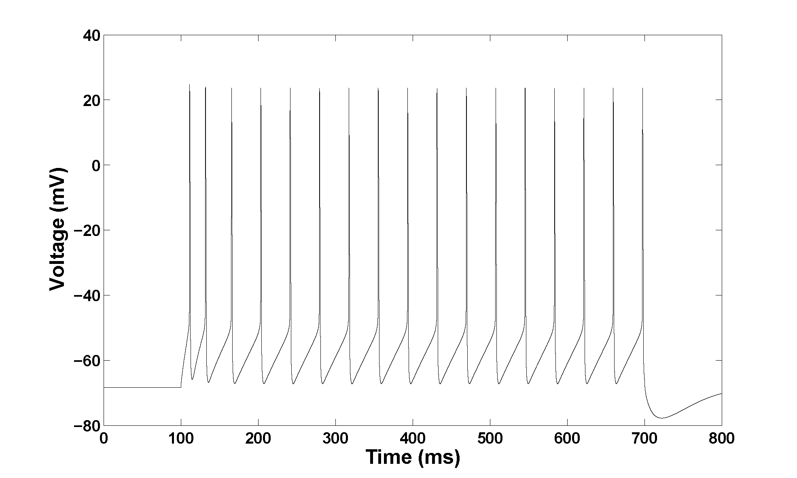
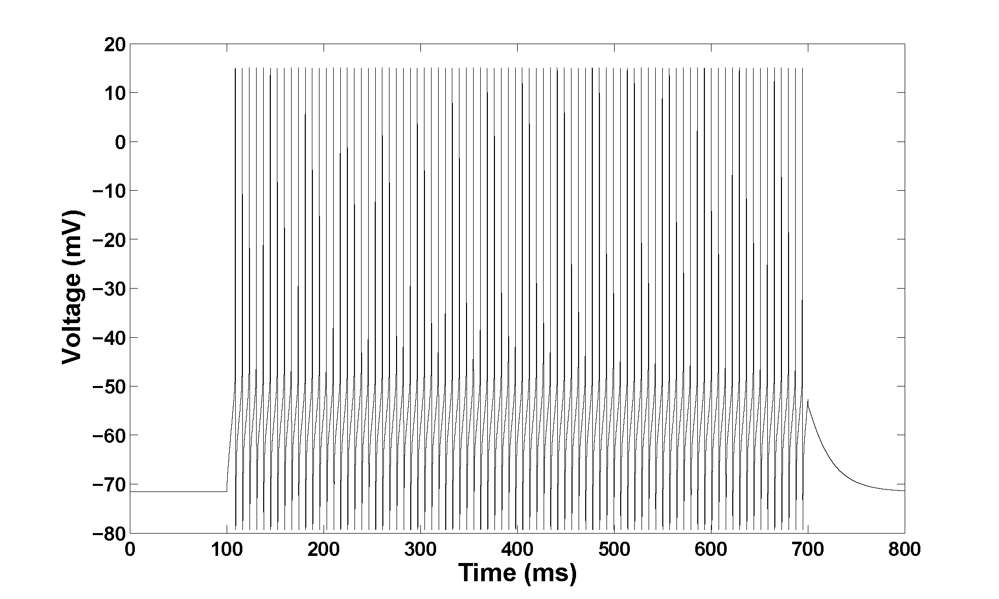
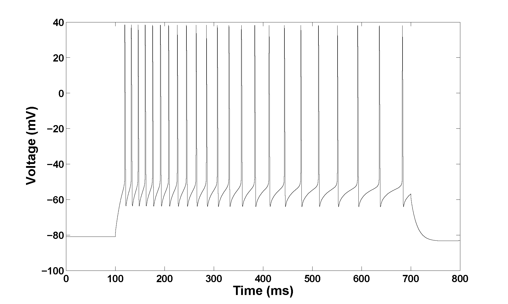
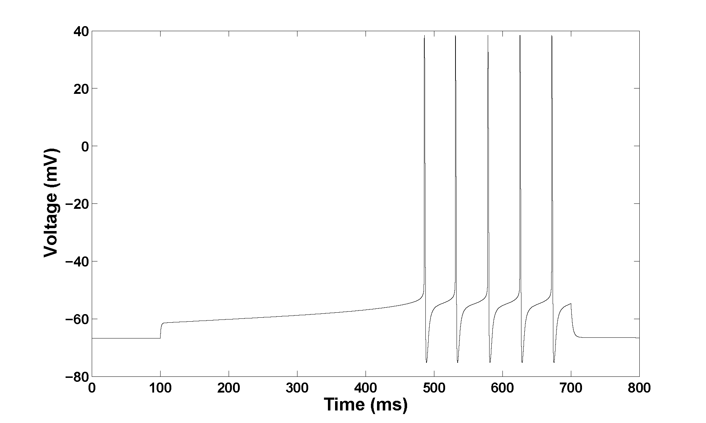
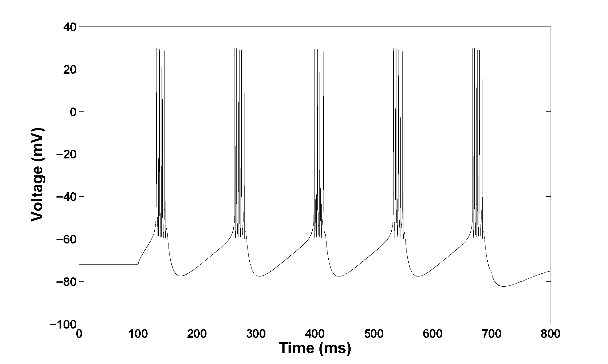
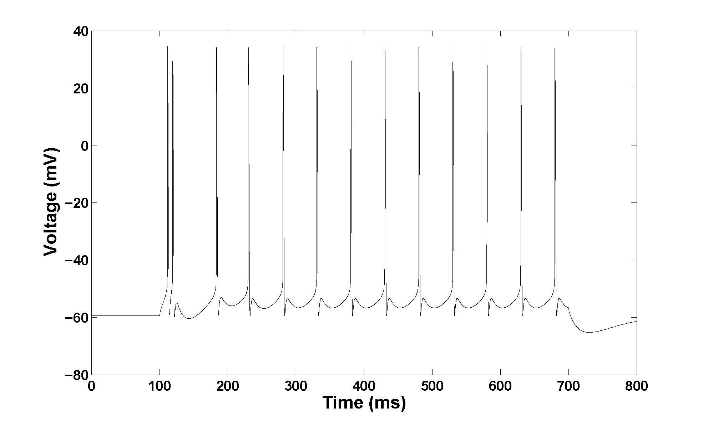

# Electrophysiological classes of neocortical neurons - Hodgkin Huxley Formalism
Electrophysiological classes of neocortical neurons - Hodgkin Huxley Formalism

|||
------------ | -------------
 | 
 | 
 | 
